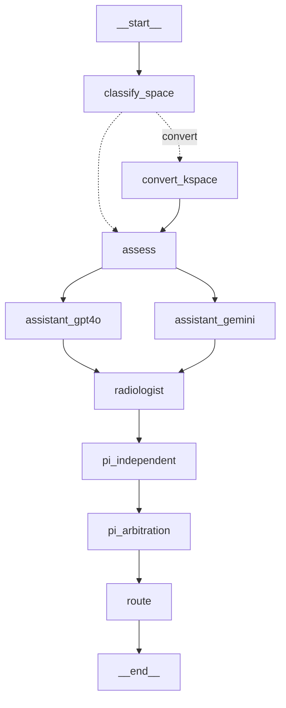

# agentnet_lc — MRI-AgentNet on LangGraph + LangChain

A behaviour-preserving re-implementation of the pipeline in
`agent_multi_meta_learning.py`, built on the tooling that production LLM systems
actually use. The original stays in place; this package sits beside it so the two
can be compared on the same evaluation set.

## Why this is a real refactor and not a veneer

The original pipeline is a 270-line `process()` method that calls five models in
sequence, threads fifteen local variables between them, and recovers structured
data from free text with ~250 lines of regex and spaCy. Every one of those
properties is something a framework removes:

| Original | Here | What it buys |
|---|---|---|
| `parse_gpt4o_response`, `parse_evaluator_response`, `extract_reasoning` (~250 lines of regex + spaCy) | `schemas.py` — Pydantic models via `with_structured_output` | Malformed output becomes a caught validation error and a retry, not a silently wrong field |
| Prompt instructions like *"never omit any of the 5 points"*, *"do not use newline characters"* | Nothing — the schema is the contract | Prompts carry domain content only |
| Three near-identical `get_*` methods, each with a 4-level `try/except` cascade to dig text out of the response | `llms.py` — one `_structured()` helper | Provider-agnostic; swapping models is one line |
| `for model_name, model_interface in models:` (sequential) | Two LangGraph edges out of one node | The two assistants run **concurrently**; wall-clock is max, not sum |
| No retry, no fallback | `.with_retry()` + `.with_fallbacks()` | An OpenAI outage transparently fails over to Gemini |
| `classification_results[1]` indexed unconditionally | `successful_opinions()` + `AgentOpinion.failed()` | One dead provider degrades the panel instead of raising `IndexError` |
| 15 local variables in one method | `state.py` — typed `PipelineState` with reducers | Checkpointing, resumption, and parallel writes |
| `print()` statements | LangSmith spans | Per-node latency, token cost and full traces, no code changes |
| Tkinter file dialog + `input()` | `cli.py` (argparse) | Runs headless, over a directory, in CI |
| Dropbox upload for a public image URL | base64 `data:` URI | Scans never leave the machine — removes the biggest deployment blocker |
| Ground truth inside the router's features | `router.featurise()` | Fixes the label leakage documented in the handbook |

## Topology



Two edges out of `assess` = one concurrent superstep. Two edges into
`radiologist` = a barrier that waits for both.

## Install and run

```bash
python -m venv .venv && source .venv/bin/activate
pip install -r requirements.txt -r requirements-langchain.txt

export OPENAI_API_KEY=...
export GOOGLE_API_KEY=...
export LANGSMITH_TRACING=true          # optional; tracing needs no code change
export LANGSMITH_API_KEY=...

python -m agentnet_lc.cli --print-graph
python -m agentnet_lc.cli --input scan.png --ground-truth "motion corrupted"
python -m agentnet_lc.cli --input data/ --glob "*.png" --jsonl traces/cases.jsonl
```

Tests need no keys and no network:

```bash
python -m pytest tests/ -v
```

## Closing the loop

`--jsonl` writes one row per case. That file is the input to everything else:

```bash
python model_selection/router_v2.py --traces traces/cases.jsonl   # retrain the router
python evals/langsmith_eval.py --upload data/labelled.jsonl       # versioned dataset
python evals/langsmith_eval.py --run --variant full_pipeline      # ablation table
python evals/dspy_optimize.py --train ... --dev ...               # compile the prompt
```

It is also the distillation and GRPO training set described in Sections 17.4–17.6
of the interview handbook.

## Status

Verified offline against `langgraph 1.2.11` / `langchain-core 1.6.1` /
`pydantic 2.13.5`: the graph compiles, all seven tests pass with stub models,
and the topology renders as drawn above. **Not yet run against live APIs** — that
needs credentials. The `convert_kspace` node delegates to the existing
`utils.data_processing_confidence` helpers, and `run_model` (CycleGAN inference)
is deliberately not wired in, because the `models/` package it imports is absent
from this checkout.
